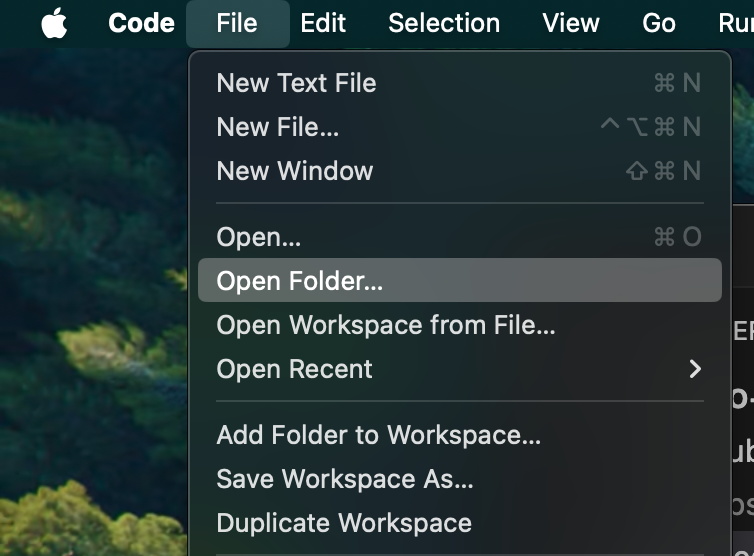
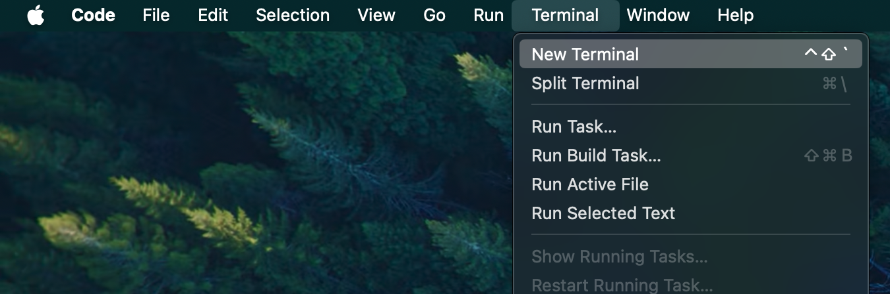
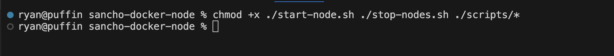
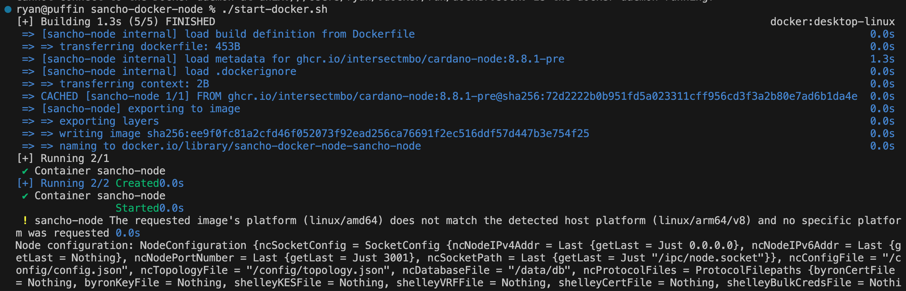
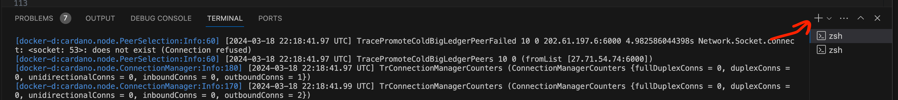
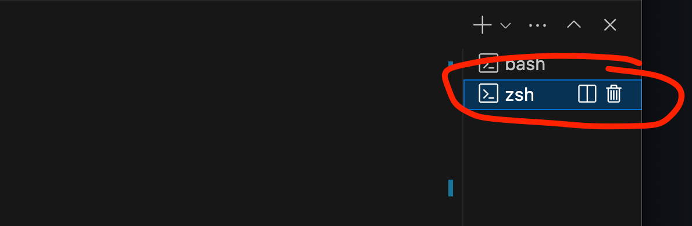
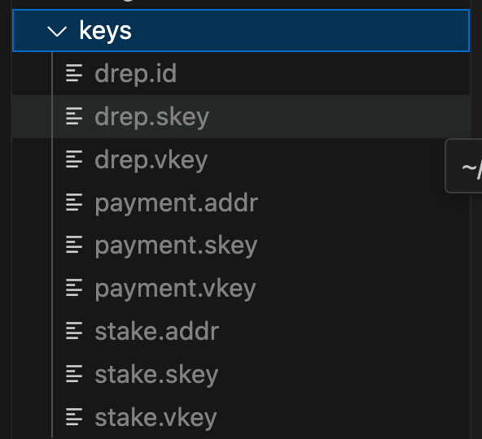

# SanchoNet docker node 🤠

**Current version:** node `10.1.3`

A simple dockerized Cardano node setup, for SanchoNet testing.

Accompanied by a few helpful scripts for cardano-cli to interact with the node and SanchoNet.

## Prerequisites

### `Docker`

Install docker desktop for your operating system.
- https://docs.docker.com/engine/install/

If you are using Apple silicon (M1, M2, M3 processor) make sure you have Rosetta enabled via Docker desktop settings.

### Visual Studio Code

Install VSCode so we can more easily navigate directories, and inspect files.
- https://code.visualstudio.com/

### Mac Specific Prerequisites

1. xcode tools.

```zsh
xcode-select --install
```

2. Rosetta.
```zsh
softwareupdate --install-rosetta
```

### Windows Specific Prerequisites

Windows Subsystem for Linux.

[How to Install WSL on Windows](https://learn.microsoft.com/en-us/windows/wsl/install)

## Setup Guide

### 1. Clone this repository.

You may want to make a nice folder/directory for this first.
```bash
git clone https://github.com/Ryun1/sancho-docker-node.git
```

### 2. Open `sancho-docker-node` from within Visual Studio Code.

Open Visual Studio Code and then go `File > Open Folder` selecting `sancho-docker-node` folder.



### 3. Open a terminal in Visual Studio Code.

Open a terminal inside of VSCode.



### 4. Update script permissions.

Inside the terminal console, give scripts execute file permissions.

Windows users will have to run this first, to access the wsl environment.
```bash
wsl
```

Run the following command.
```zsh
chmod +x ./start-docker.sh ./stop-docker.sh ./scripts/*
```



**Note:** Make sure your terminal shows the correct directory `sancho-docker-node`.

## Basic Usage

**Note:** Before any usage ensure you have docker desktop open and running.

### Start node

We have a script that:
- pulls the latest SanchoNet node configs
- pulls the Cardano node docker image
- builds and runs the Cardano node image
- pushes the node logs to the terminal

In your terminal execute:
```bash
./start-docker.sh
```

If you want to stop the logs (but the node is still running) you can press `control + c`.

This should look something like:



**Note:** The first time you do this the node will take a long time to synchronize to the network.

### Check node is running

#### 1. Open a new terminal

Press the plus at the top right of your terminal window.



And then click on the new terminal.



#### 2. Query tip of node.

Run the node query tip script.

Windows users will have to run this first, to access the wsl environment.
```bash
wsl
```

In your second terminal execute:
```bash
./scripts/node-query-tip.sh
```

For a fully synced node the terminal should return, with `syncProgress` of `100.00`.

```bash
{
    "block": 1185368,
    "epoch": 277,
    "era": "Conway",
    "hash": "13d654899faabb50522f7f608e8d627acaaa8206347c913b0e74754538754eb5",
    "slot": 24011698,
    "slotInEpoch": 78898,
    "slotsToEpochEnd": 7502,
    "syncProgress": "100.00"
}
```

For a un-fully synced node the terminal should return, with `syncProgress` of less than `100.00`.
You will have to wait till fully synced node before being able to interact with the network.

```bash
{
    "block": 14646,
    "epoch": 3,
    "era": "Babbage",
    "hash": "d72cb1cfb7f7eb9d457d48c0d3e165170565eb371f8f5c7cb3d6d212be97c797",
    "slot": 292713,
    "slotInEpoch": 33513,
    "slotsToEpochEnd": 52887,
    "syncProgress": "1.22"
}
```

### Stop node

This script will stop your Cardano node, remember to run this when you are done using your node.

In your second terminal execute:
```bash
./stop-docker.sh
```

## Doing Stuff

Now you have a node you can actually ✨*do fun stuff*✨

### Setup keys and get tAda

#### 1. Generate keys, addresses and a DRep ID.

We have a script that:
- randomly generates a set of payment, stake and DRep keys
- from keys, creates addresses and a DRep ID 

In a terminal execute:
```bash
./scripts/generate-keys.sh
```

This will create you a keys directory with some fun things inside, looks like this:



#### 2. Get some tAda.

Get yourself some test ada, so you can pay for transaction fees.

Open your new address from [./keys/payment.addr](./keys/payment.addr).

Go to the [SanchoNet faucet](https://sancho.network/faucet) and request some tAda sent to your new address.

### Run Scripts

Check out the [scripts folder](./scripts/) and see what you'd like to do.

I will give an example of what you could do.

Make sure you have a node running for these.

#### Become a DRep, delegate to self and vote.

##### 1. Register as a DRep.

```bash
./scripts/drep/register.sh
```

##### 2. Register your stake key (needed before delegating).

```bash
./scripts/stake/key-register.sh
```

##### 3. Delegate your tAda's voting rights to yourself.

```bash
./scripts/drep/delegate-to-self.sh
```

## Common Error Messages

### Docker desktop application not open

```bash
Cannot connect to the Docker daemon at unix:///Users/XXXX/.docker/run/docker.sock. Is the docker daemon running?
```

**Fix:** Open docker desktop
